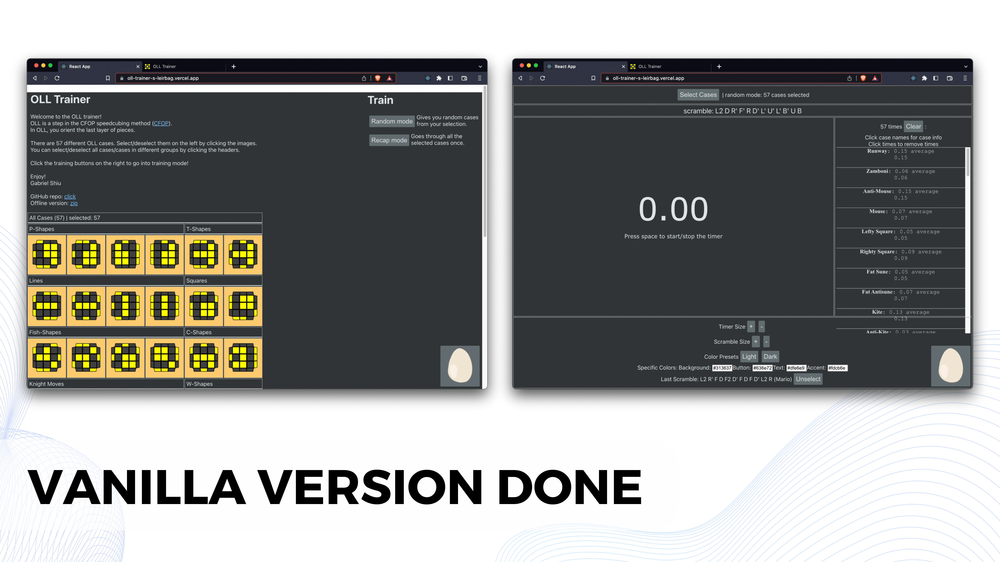
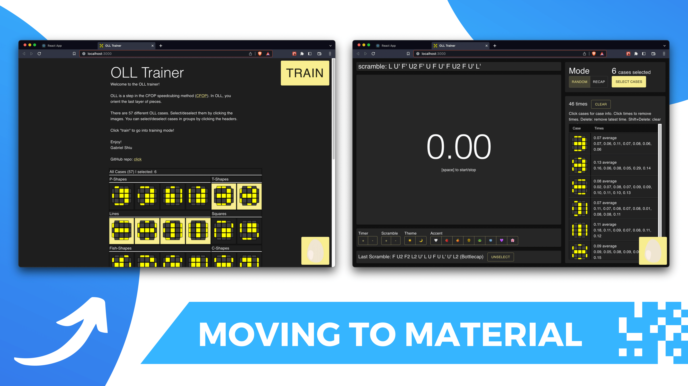

# OLL Trainer

## https://oll-trainer-s-leirbag.vercel.app/

Used to practice Rubik's cube OLL algorithms. You select which cases to practice and then time yourself on them.

It is based on https://github.com/Roman-/oll_trainer by Roman Strakhov but I used React and MUI instead of pure JS and CSS. I wanted to have a manageable website I could copy using React to gain experience in React. I used lots of Roman's code: the algorithms list, scramble generation, and some program structure.

## To-do

- Use Typescript
- Add prop type checking with PropTypes

## Milestones

### Vanilla Version Done
Finished the site in vanilla JS/CSS. Close copy of Roman Strakhov's site, but was nice to have something to learn from. Enjoyed adding an easter egg and developing the theme system more.

### Moving to Material UI
Moved from vanilla JS/CSS to MUI in 3 days! A little painful but MUI is really great. Began to modify Roman Strakhov's UI layout, enjoyed designing some UI myself!

## Credits

Lots of code from https://github.com/Roman-/oll_trainer by Roman Strakhov  
Based the timer code off of [Geeks for Geeks' Create a Stop Watch using ReactJS](https://www.geeksforgeeks.org/create-a-stop-watch-using-reactjs/)  
This project was bootstrapped with [Create React App](https://github.com/facebook/create-react-app)  
Egg images from a built in sprite in [Scratch](https://scratch.mit.edu/)  
[Material UI](https://mui.com/)  
God